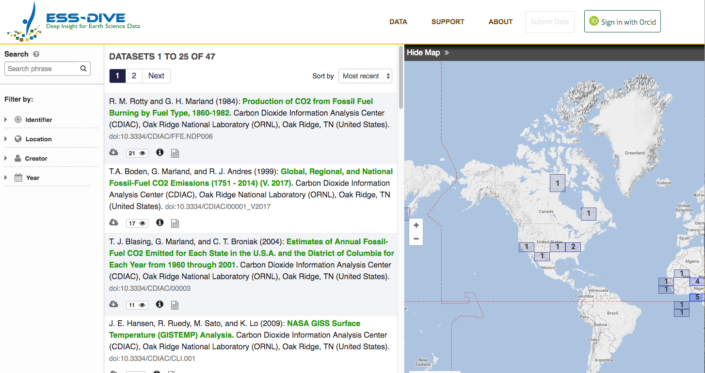
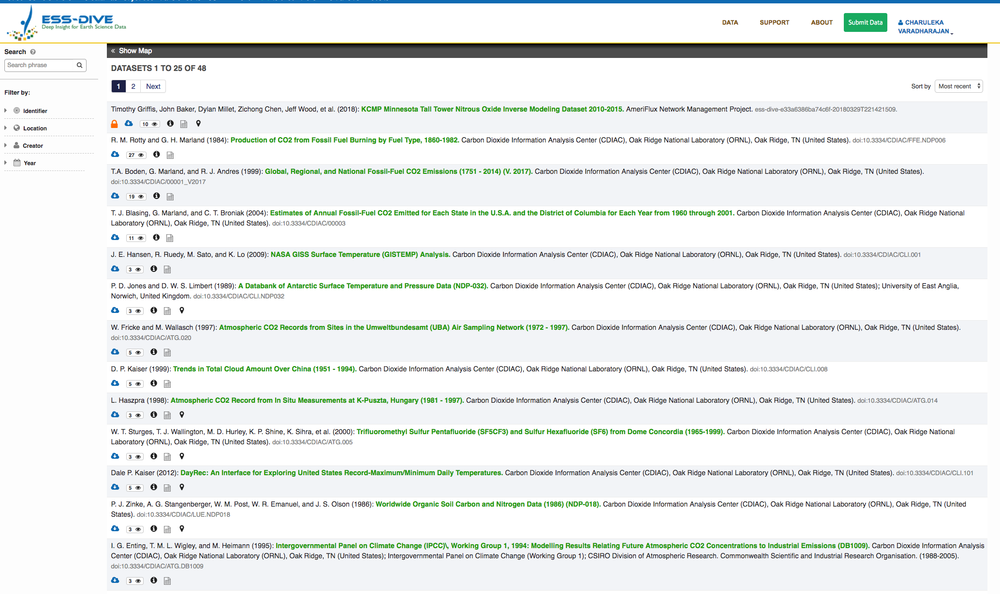
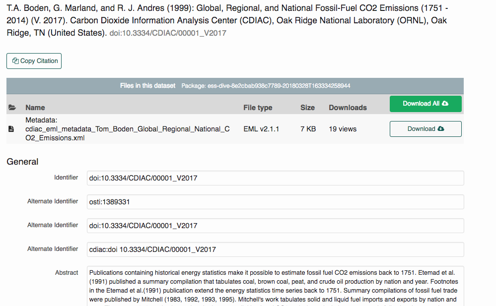

# **ESS-DIVE DATA ARCHIVE: SEARCH AND DATA ACCESS**

**ESS-DIVE DATA PORTAL**: [https://data.ess-dive.lbl.gov](https://data.ess-dive.lbl.gov/#submit)

**HELP DESK:** [ess-dive-support@lbl.gov](mailto:ess-dive-support@lbl.gov)

## QUICK START GUIDE

1. Go to **[https://data.ess-dive.lbl.gov](https://data.ess-dive.lbl.gov/#submit)**

2. Browse for datasets using the listing or the map.  

3. Search for data using the search bar on the left.

4. Click on a dataset title to view the full data package

5. To download data: Create an [ORCID](https://orcid.org/register) and login your ORCID.

6. Click on the Download data button in the data package view or the blue cloud icon in the main search page.

## DETAILED INSTRUCTIONS

### 0. GENERAL INFORMATION

* * *
** **

**Preferred Browsers**

* Chrome 

* Firefox 

* Safari

* May have some issues with Internet Explorer

### 1. ESS-DIVE OVERVIEW

* * *

**Click the link to the ESS-DIVE data portal:****[** ](https://data.ess-dive.lbl.gov/#submit)**[https://data.ess-dive.lbl.gov**/](https://data.ess-dive.lbl.gov/)

By default, you will see the ESS-DIVE homepage (Figure 2). You will see three main sections - a search bar on the left (see Section 3), a dataset listing in the middle, and a map on the right. 

By default, you will see all **public data packages** on ESS-DIVE. If you wish to view your unpublished data packages, or to download data, click on the "Sign in with Orcid" button in the top right corner. Login with your ORCID credentials.

**Figure 2** ESS-DIVE Data portal home screen.

You will see the citation for a data package, which is in the form: Authors (Publication Date): **Dataset Title**. Project. DOI or ESS-DIVE ID. 

**Figure 3** ESS-DIVE Dataset Citations

There are various symbols that appear beneath the data citation (not all of them appear on all the datasets). Tooltips appear if you hover over the icon. This is what they mean:

Orange Lock Icon: The record is unpublished, and only visible to you. If the lock is not visible, it means the data package is public and can be viewed by anyone.

Cloud Icon: This is the link that you should click to download files. It will appear blue if the data can be downloaded, and gray if you don’t have access to download the data.

The number with the eye icon: This refers to the number of views this dataset has received. 

Info icon: Shows a preview of the abstract.

Files icon: Indicates whether there are any data files associated with the package. If this icon is not visible, it means only metadata are available for the data package. 

Map marker icon: Refers to how many other datasets are associated with that location.

You can get choose to hide Map by clicking on the Hide Map link (Figure 4), which will allow you to view more listings on your web page (Figure 5).  

**Figure 4** The link to hide the map.

**Figure 5** View of the home page without the map

### 2. VIEWING A DATA PACKAGE AND DOWNLOADING DATA

* * *

Click on the Dataset Title link to view the data set. This should bring up a page with the citation on the top, and  all the data files and the metadata (Figure 6). From here you can download files individually  or you can click Download All to get the entire package. Scroll below the files section to view the metadata for the file.

 

**Figure 6** View of the data package with links to download the data

Here are the metadata fields (only the fields entered by the data provider will be visible)

* Identifier/Alternate Identifiers: Identifiers in ESS-DIVE or other systems for this data package (includes the DOI if applicable)

* Abstract - Brief description of the data package

* Keywords and variables - Categorical Keywords that indicate the general themes of this data package, and data variables associated with the package

* Publication Date - Date this package was published

* Data Table, Image and Other Data Details - The details about the files uploaded, including files sources and derivations  

* People and Associated Parties - Creators, Contact, Contributors, and related Funding agencies.

* Geographic Region - Information about where the data were collected, along with a map view

* Temporal Coverage - Date period the data spans

* Project Information - Information about the DOE project the data is associated with

* Methods - Methods that were used to produce the data, including processing, QA/QC, site information etc.

* Usage Rights - The usage rights under which this data package is released. Anyone using the data must comply with the usage rights specified on the package.

### 3. SEARCHING FOR DATA

* * *

You can search for data using the options in the left sidebar (Figure 7). It will allow you to do a generic search for data package attributes. (e.g. Title, keyword, PI name). You can also refine the search by using more specific fields -  identifier (e.g. DOI), location, creator (authors), and year (publication year or date range spanned in the dataset). 

**Figure 7** Expanded Search options

